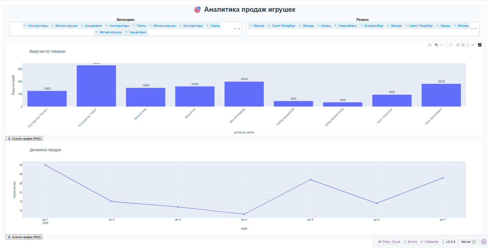

# 🎯 Анализ продаж интернет-магазина игрушек

Интерактивный дашборд для анализа продаж игрушек, созданный на Python с использованием Dash, Plotly и Pandas.

## 📊 Возможности

- 📈 Визуализация выручки по товарам
- 📅 Анализ динамики продаж по дням
- 🔍 Фильтрация по **категории** и **региону**
- 💾 Кнопки для экспорта графиков в **PNG**
- 🧩 Работает локально — без интернета

## 🚀 Как запустить

1. Убедитесь, что установлен Python (рекомендуется 3.9+)
2. Установите зависимости:
   `pip install pandas dash plotly`
3. Запустите дашборд:
   `streamlit run toy_dashboard.py`

После запуска проекта вы увидите интерактивный дашборд, где можно:
- Анализировать продажи по категориям.
- Отслеживать динамику продаж во времени.
- Изучать географическое распределение продаж.

## Скриншот:

Автор: Александр Рассказин

Телеграм: @Rasskazin_Alexandr

Почта: rasskazin2016@mail.ru

Если у вас есть вопросы или предложения, обращайтесь!

